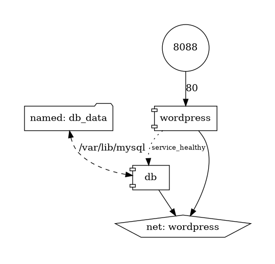

# Docker Compose Diagramm zu Code

In dieser Übung wollen wir versuchen von einem Diagramm zu einer Docker Compose
Datei zu finden. Es handelt sich um eine Wordpress Web Applikation mit einer
MariaDB als Datenbank.

[Wordpress](https://wordpress.com/de/) ist das meist verwendete CMS im Internet.
Um die 90% aller Webseiten basieren darauf.

[MariaDB](https://mariadb.org/) ist ein fork von MySql. Diese zwei Datenbanken
sind sehr ähnlich, sind in den neuesten Versionen jedoch nicht mehr 100%
kompatibel.



## Auftrag

Erstellen Sie eine `docker-compose.yml` Datei min Hilfe vom Diagramm und
folgenden Zusatzinformationen. Starten und Stoppen Sie die Applikation.

### Datenbank

- Name im Diagramm ersichtlich
- Docker Image: mariadb
- Ports im Diagramm ersichtlich
- Volumen im Diagramm ersichtlich
- Umgebungsvariablen
  - MYSQL_ROOT_PASSWORD=somewordpress
  - MYSQL_DATABASE=wordpress
  - MYSQL_USER=wordpress
  - MYSQL_PASSWORD=wordpress
- Networks im Diagramm ersichtlich
- healthcheck:
  ```yaml
  healthcheck:
    test: ["CMD", "healthcheck.sh", "--connect", "--innodb_initialized"]
    start_period: 10s
    interval: 10s
    timeout: 5s
    retries: 3
  ```

### Web Applikation

- Name im Diagramm ersichtlich
- Docker Image: wordpress
- Ports im Diagramm ersichtlich
- Umgebungsvariablen
  - WORDPRESS_DB_HOST=db
  - WORDPRESS_DB_USER=wordpress
  - WORDPRESS_DB_PASSWORD=wordpress
  - WORDPRESS_DB_NAME=wordpress
- Networks im Diagramm ersichtlich
- Abhängigkeit zur DB
  ```yaml
  depends_on:
    db:
      condition: service_healthy
  ```

### Volumen und Netzwerk

Es sollte auf Toplevel ein Netzwerk und ein Volumen erstellt werden. Die Namen
sind im Diagramm ersichtlich. Das Netzwerk ist vom Typ "bridge"

### Starten

Die Applikation sollte mit folgendem Befehl gestartet werden können.

```bash
docker compose up -d
```

Danach sollte sie in einem Browser die URL `http://localhost:8088` aufrufen und
ein Installations Wizzard für das CMS sehen.

Gestoppt werden kann die ganze Applikation durch den Befehl

```bash
docker compose down
```
